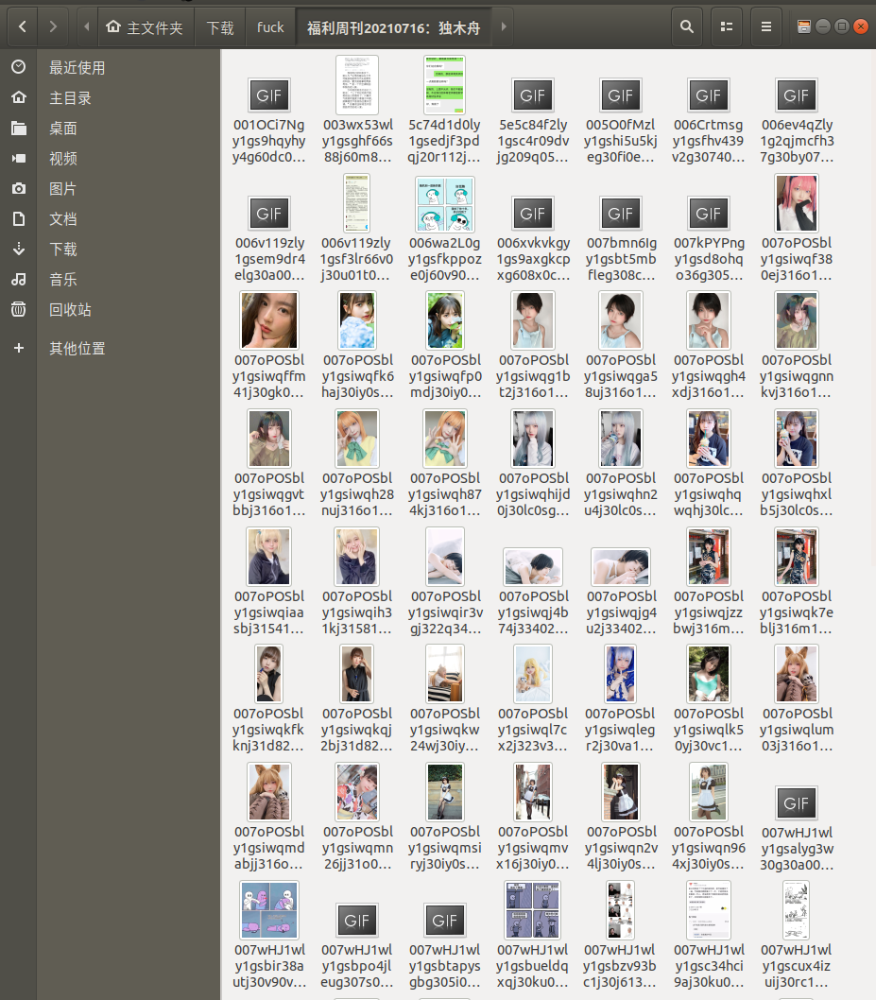

# 好人卡福利周刊的爬取

## 介绍

[好人卡首页](https://zhaisiji.net/)  
有时候网络波动，加载的图片卡住，就想刷新一下  
手痒写了一个爬取程序，直接等爬取完毕后再看就行了  

## 用法

首先在 **haorenka/setting.py** 中设置存放图片的文件夹 **FILESSTORE**   
然后在命令行下，输入  

    scrapy crawl album -a album_url '福利周刊第一页的地址'

等一会就好  

## 实例

在 **haorenka/setting.py** 中  

    FILES_STORE = '/home/steiner/下载/fuck'

以最近更新的周刊 [福利周刊20210716：独木舟](https://zhaisiji.net/20210716.html) 为例，他的 URL 地址是 <https://zhaisiji.net/20210716.html>  
在命令行输入  

    scrapy crawl album -a album_url https://zhaisiji.net/20210716.html

  

嘿嘿  
<https://encrypted-tbn0.gstatic.com/images?q=tbn:ANd9GcR_QSZ14mOnwuRPUdE43Jc846UpkB8ufucf3w&usqp=CAU>  

